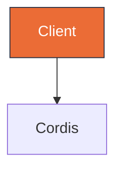

# Diagram Studio

Hybrid Mermaid + editorial HTML for architecture, sequence, class, ER, and state diagrams.

## When to Use

Use when the reader learns more from a visual than from a paragraph or table. Ideal for system architecture, message flows over time, entity relationships, class structures, and state transitions with guards.

Don't use for simple lists, single before/after comparisons, or a one-sentence relationship that a table can express — use a table instead.

## Selection

Choose the Mermaid type by the semantic pattern, not by habit. See `references/cheatsheet.md` for minimal examples.

| If showing… | Use | Reference |
|---|---|---|
| Components + connections | flowchart | cheatsheet.md#flowchart |
| Messages over time | sequenceDiagram | cheatsheet.md#sequence |
| States + guards | stateDiagram | cheatsheet.md#state |
| Entities + fields | erDiagram | cheatsheet.md#er |
| Classes + ops | classDiagram | cheatsheet.md#class |

Full 39-type editorial taxonomy from `cathrynlavery/diagram-design` is mapped to these 5 Mermaid types — start with the table above before inventing a new form.

GitHub-compatible Mermaid style: use `flowchart TB` or `flowchart LR` (never legacy `graph`), add `classDef` tokens from `references/style-guide.md`, and use `linkStyle`/`style` sparingly for the focal path.

## Editorial Discipline (from diagram-design)

Extracted from `cathrynlavery/diagram-design` — see `references/diagram-design-learnings.md`:

- **Density 4/10** — generous whitespace, no wall of boxes. Every node must earn its place.
- **>9 nodes → split** into overview + detail diagrams rather than cramming.
- **Accent 1-2 max** — use `classDef focal fill:#eb6c36,stroke:#2d3142` for the single hot path; all other nodes stay `paper`/`muted`. No shadows (`shadow:false`), `rx:6` max, mono only for ports/URLs.
- **Confirm before drawing** — state `type, size preset (85%/100%), what will be cut due to budget` and wait for redirect if the user is reachable. Never assume the diagram scope.

## Where to Write

- `docs/architecture.md §1.1` — single source for the umbrella architecture (do not duplicate elsewhere).
- `docs/specs/*-design.md` — for RFC/spec diagrams; each spec may embed one Mermaid block that lives with the design.
- `docs/diagrams/<slug>.html` — for editorial export (optional, self-contained HTML+SVG for client decks). Link preview via `` in markdown when needed.

Add `docs/diagrams/.gitkeep` if the folder is otherwise empty.

## Verify & Drift

Always call `mermaid_verify` before commit — it runs `mermaid.parse()` + optional `mermaid-cli` validate and returns `{ok, errors, warnings}`. Never commit a diagram that fails parse. Anti-patterns (e.g. `shadow`, `graph` legacy) are reported as warnings in strict mode.

Run drift check before PR: `mermaid_drift --diagram docs/architecture.md --roots packages/*,govard/internal/*,maestro-skills/skills` to flag `missingInCode / staleEdges / missingInDiagram` against the codebase (inspired by `diagram-drift`). Fix drift by patching the doc or the code reference.

CLI fallback when the plugin is not installed: `node maestro-skills/skills/diagram-studio/scripts/verify-mermaid.mjs docs/architecture.md` or `node scripts/verify-mermaid.mjs <file|->`.

