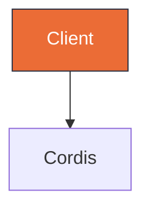

# Diagram Studio

Hybrid Mermaid + editorial HTML for architecture, sequence, class, ER, and state diagrams.

## When to Use

Use when the reader learns more from a visual than from a paragraph or table. Ideal for system architecture, message flows over time, entity relationships, class structures, and state transitions with guards.

Don't use for simple lists, single before/after comparisons, or a one-sentence relationship that a table can express — use a table instead.

## Selection

Choose the Mermaid type by the semantic pattern, not by habit. See `references/cheatsheet.md` for minimal examples.

| If showing… | Use | Reference |
|---|---|---|
| Components + connections | flowchart | cheatsheet.md#flowchart |
| Messages over time | sequenceDiagram | cheatsheet.md#sequence |
| States + guards | stateDiagram | cheatsheet.md#state |
| Entities + fields | erDiagram | cheatsheet.md#er |
| Classes + ops | classDiagram | cheatsheet.md#class |

Full 39-type editorial taxonomy from `cathrynlavery/diagram-design` is mapped to these 5 Mermaid types — start with the table above before inventing a new form.

GitHub-compatible Mermaid style: use `flowchart TB` or `flowchart LR` (never legacy `graph`), add `classDef` tokens from `references/style-guide.md`, and use `linkStyle`/`style` sparingly for the focal path.



## Editorial Discipline (from diagram-design)

Extracted from `cathrynlavery/diagram-design` — see `references/diagram-design-learnings.md`:

- **Density 4/10** — generous whitespace, no wall of boxes. Every node must earn its place.
- **>9 nodes → split** into overview + detail diagrams rather than cramming.
- **Accent 1-2 max** — use `classDef focal fill:#eb6c36,stroke:#2d3142` for the single hot path; all other nodes stay `paper`/`muted`. No shadows (`shadow:false`), `rx:6` max, mono only for ports/URLs.
- **Confirm before drawing** — state `type, size preset (85%/100%), what will be cut due to budget` and wait for redirect if the user is reachable. Never assume the diagram scope.

## Where to Write

- `docs/architecture.md §1.1` — single source for the umbrella architecture (do not duplicate elsewhere).
- `docs/specs/*-design.md` — for RFC/spec diagrams; each spec may embed one Mermaid block that lives with the design.
- `docs/diagrams/<slug>.html` — for editorial export (optional, self-contained HTML+SVG for client decks). Link preview via `` in markdown when needed. Use spacing tokens from `references/style-guide.md#deck-html-layout-tokens` (header 16px, line-height 1.6) so deck text isn't cramped — verify with `grep line-height`.
- `docs/diagrams/maestro-harness-deck.html` — 3-page A4 deck (cover + 2 diagrams). Must use deck layout tokens above; header `flowchart TB` and `10 plugins + meta` must have 8px gap, not `flowchart TB10`.

Add `docs/diagrams/.gitkeep` if the folder is otherwise empty.

## Audience Rules (what to show for Team vs Client)

Every diagram has two audiences. The skill MUST decide on `audience` before writing `docs/diagrams/<slug>.html` (default is `team` when not specified — ask 1 line if unclear). Use this exact checklist:

| Element | Team / Internal (`audience: team|internal|engineering|review` or prompt has "cho team / keep source / để team xem") | Client / External (`audience: client|pitch|deck|external` or prompt has "cho khách / clean deck / bản đẹp cho khách") |
|---|---|---|
| **Rendered diagram** (inline SVG, self-contained, no JS) | Yes — always | Yes — always |
| **Mermaid source** ```mermaid | Yes — inside `<details><summary>Mermaid source</summary><pre class="mermaid">…</pre></details>` collapsed by default (so `mermaid_verify` can re-check, GitHub diff preserved) | **No** — remove `<pre>` and `<details>` entirely |
| **Editorial tokens card** (paper/ink/accent swatches, hex) | Yes — keep the "Editorial tokens" card (so team knows palette to maintain) | **No** — remove the whole card (client only needs the diagram, not the design system) |
| **Technical footer** (file path, `verify {"ok":true}`, `drift missingInCode 0`, generation note) | Yes — keep the "About this export" card with `Source: docs/...`, verify/drift line, `mermaid_verify`/`mermaid_drift` mention | **No** — remove or reduce to 1 line: `Generated via diagram-studio — 2026-08-27` (no file paths, no verify/drift) |
| **Styling** | Full tokens `paper/ink/accent/muted/link` as in `references/style-guide.md` | Same tokens (visual stays identical) — only the meta cards differ |

Rules for other locations (not audience-driven):
- `docs/architecture.md` and `docs/specs/*-design.md` — **always show source** as ```mermaid block (GitHub renders it, diffable, single source of truth, `mermaid_verify` checks it) — audience rule does not apply here.
- `docs/diagrams/*.pdf` deck — **always client rules** (hide source, hide tokens card, hide technical footer, use PNG only) — PDF is for distribution.

When `audience` is ambiguous, **default to Team** (show everything collapsed) and add a 1-line note: "Hiding source/tokens for client — say 'clean for client' to hide."

## Supported Cases (summary — details in `references/supported-cases.md`)

This skill is **case-complete** — 5 diagram types × 2 audiences × 3 outputs × 3 verifications, all live-verified (`packages/dsh-maestro-diagram` 8/8, `maestro-workspace -r verify` 13 Done). See `references/supported-cases.md` for the full tables.

| # | Mermaid type | When to use | Audience variants | Output |
|---|---|---|---|---|
| 1 | `flowchart TB/LR` | Components + connections | Team: `harness-architecture.html` 16K (svg+pre) → Client: `...-client.html` 12K (svg only) | `docs/architecture.md §1.1` + HTML + PDF p1 |
| 2 | `sequenceDiagram` | Messages over time | Team: `harness-turn-flow-sequence.html` 31K → Client: `...-client.html` 30K | `docs/specs/...-sequence.md` + HTML + PDF p2 |
| 3 | `classDiagram` | Classes + ops | Team/Client per Audience Rules | `cheatsheet.md#class` |
| 4 | `erDiagram` | Entities + fields | Team/Client | `cheatsheet.md#er` |
| 5 | `stateDiagram` | States + guards | Team/Client | `cheatsheet.md#state` |

All 5 share tokens `paper/ink/accent/muted/link` (no shadow, rx:6, accent 1-2). Verification: `mermaid_verify` 5/5 PASS, `mermaid_drift` missingInCode 0, `strict` warns on `shadow:true`. Details and live case studies in `references/supported-cases.md`.

## Verify & Drift

Always call `mermaid_verify` before commit — it runs `mermaid.parse()` + optional `mermaid-cli` validate and returns `{ok, errors, warnings}`. Never commit a diagram that fails parse. Anti-patterns (e.g. `shadow`, `graph` legacy) are reported as warnings in strict mode.

Run drift check before PR: `mermaid_drift --diagram docs/architecture.md --roots packages/*,govard/internal/*,maestro-skills/skills` to flag `missingInCode / staleEdges / missingInDiagram` against the codebase (inspired by `diagram-drift`). Fix drift by patching the doc or the code reference.

CLI fallback when the plugin is not installed: `node maestro-skills/skills/diagram-studio/scripts/verify-mermaid.mjs docs/architecture.md` or `node scripts/verify-mermaid.mjs <file|->`.

