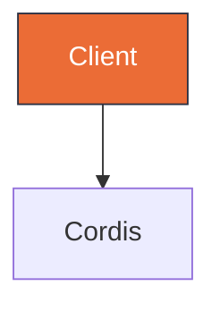

# Diagram Studio

Hybrid Mermaid + editorial HTML for architecture, sequence, class, ER, and state diagrams.

## When to Use

Use when the reader learns more from a visual than from a paragraph or table. Ideal for system architecture, message flows over time, entity relationships, class structures, and state transitions with guards.

Don't use for simple lists, single before/after comparisons, or a one-sentence relationship that a table can express — use a table instead.

## Selection

Choose the Mermaid type by the semantic pattern, not by habit. See `references/cheatsheet.md` for minimal examples.

| If showing… | Use | Reference |
|---|---|---|
| Components + connections | flowchart | cheatsheet.md#flowchart |
| Messages over time | sequenceDiagram | cheatsheet.md#sequence |
| States + guards | stateDiagram | cheatsheet.md#state |
| Entities + fields | erDiagram | cheatsheet.md#er |
| Classes + ops | classDiagram | cheatsheet.md#class |

Full 39-type editorial taxonomy from `cathrynlavery/diagram-design` is mapped to these 5 Mermaid types — start with the table above before inventing a new form.

GitHub-compatible Mermaid style: use `flowchart TB` or `flowchart LR` (never legacy `graph`), add `classDef` tokens from `references/style-guide.md`, and use `linkStyle`/`style` sparingly for the focal path.



## Editorial Discipline (from diagram-design)

Extracted from `cathrynlavery/diagram-design` — see `references/diagram-design-learnings.md`:

- **Density 4/10** — generous whitespace, no wall of boxes. Every node must earn its place.
- **>9 nodes → split** into overview + detail diagrams rather than cramming.
- **Accent 1-2 max** — use `classDef focal fill:#eb6c36,stroke:#2d3142` for the single hot path; all other nodes stay `paper`/`muted`. No shadows (`shadow:false`), `rx:6` max, mono only for ports/URLs.
- **Confirm before drawing** — state `type, size preset (85%/100%), what will be cut due to budget` and wait for redirect if the user is reachable. Never assume the diagram scope.

## Where to Write

- `docs/architecture.md §1.1` — single source for the umbrella architecture (do not duplicate elsewhere).
- `docs/specs/*-design.md` — for RFC/spec diagrams; each spec may embed one Mermaid block that lives with the design.
- `docs/diagrams/<slug>.html` — for editorial export (optional, self-contained HTML+SVG for client decks). Link preview via `` in markdown when needed.

Add `docs/diagrams/.gitkeep` if the folder is otherwise empty.

## Audience Rules (what to show for Team vs Client)

Every diagram has two audiences. The skill MUST decide on `audience` before writing `docs/diagrams/<slug>.html` (default is `team` when not specified — ask 1 line if unclear). Use this exact checklist:

| Element | Team / Internal (`audience: team|internal|engineering|review` or prompt has "cho team / keep source / để team xem") | Client / External (`audience: client|pitch|deck|external` or prompt has "cho khách / clean deck / bản đẹp cho khách") |
|---|---|---|
| **Rendered diagram** (inline SVG, self-contained, no JS) | Yes — always | Yes — always |
| **Mermaid source** ```mermaid | Yes — inside `<details><summary>Mermaid source</summary><pre class="mermaid">…</pre></details>` collapsed by default (so `mermaid_verify` can re-check, GitHub diff preserved) | **No** — remove `<pre>` and `<details>` entirely |
| **Editorial tokens card** (paper/ink/accent swatches, hex) | Yes — keep the "Editorial tokens" card (so team knows palette to maintain) | **No** — remove the whole card (client only needs the diagram, not the design system) |
| **Technical footer** (file path, `verify {"ok":true}`, `drift missingInCode 0`, generation note) | Yes — keep the "About this export" card with `Source: docs/...`, verify/drift line, `mermaid_verify`/`mermaid_drift` mention | **No** — remove or reduce to 1 line: `Generated via diagram-studio — 2026-08-27` (no file paths, no verify/drift) |
| **Styling** | Full tokens `paper/ink/accent/muted/link` as in `references/style-guide.md` | Same tokens (visual stays identical) — only the meta cards differ |

Rules for other locations (not audience-driven):
- `docs/architecture.md` and `docs/specs/*-design.md` — **always show source** as ```mermaid block (GitHub renders it, diffable, single source of truth, `mermaid_verify` checks it) — audience rule does not apply here.
- `docs/diagrams/*.pdf` deck — **always client rules** (hide source, hide tokens card, hide technical footer, use PNG only) — PDF is for distribution.

When `audience` is ambiguous, **default to Team** (show everything collapsed) and add a 1-line note: "Hiding source/tokens for client — say 'clean for client' to hide."

## Supported Cases (all that this skill + plugin handle)

This skill is **case-complete** — every combination below is verified (see `packages/dsh-maestro-diagram/tests/` 8/8 and `/tmp/diagram-studio-coverage.mmd`).

**1. Diagram types (5 Mermaid grammars, each maps from 39 editorial types):**

| # | Mermaid type | When to use (from Selection) | Minimal example file | Verified via |
|---|---|---|---|---|
| 1 | `flowchart TB/LR` | Components + connections (architecture) | `docs/architecture.md §1.1` (10 plugins + meta, density 4/10) | `mermaid_verify` + `mermaid_drift` (missingInCode 0) |
| 2 | `sequenceDiagram` | Messages over time (turn lifecycle) | `docs/specs/2026-08-27-harness-turn-flow-sequence.md` (6 participants, 7 messages) | `mermaid_verify` + HTML SVG 28K |
| 3 | `classDiagram` | Classes + ops (ReviewProvider) | `references/cheatsheet.md#class` (`ReviewProvider <|-- GitLabProvider`) | `verifyMermaid` 5/5 |
| 4 | `erDiagram` | Entities + fields (memory schema) | `references/cheatsheet.md#er` (`PROJECT ||--o{ MEMORY`) | `verifyMermaid` 5/5 |
| 5 | `stateDiagram` / `stateDiagram-v2` | States + guards (review state) | `references/cheatsheet.md#state` (`[*] --> queued`) | `verifyMermaid` 5/5 |

All 5 share tokens `paper/ink/accent/muted/link` from `references/style-guide.md` and `classDef` preset (`focal` for 1-2 nodes, `muted` for rest, no shadow, rx:6).

**2. Audiences (2) — controls 4 elements per HTML (see Audience Rules table above):**

| Audience | Trigger (`audience:` or prompt keywords) | Mermaid source | Tokens card | Technical footer | Example files |
|---|---|---|---|---|---|
| Team / Internal | `team|internal|engineering|review` or "cho team / keep source" | Yes (`<details>` collapsed) | Yes | Yes ("About this export" with verify/drift) | `harness-architecture.html` 16K (1 svg,1 pre), `harness-turn-flow-sequence.html` 31K (1 svg,1 pre) |
| Client / External | `client|pitch|deck|external` or "cho khách / clean deck" | **No** | **No** | **No** (1 line `Generated via diagram-studio — 2026-08-27`) | `harness-architecture-client.html` 12K (1 svg,0 pre), `harness-turn-flow-sequence-client.html` 30K (1 svg,0 pre) |

**3. Outputs (3) — where the diagram lives:**

| Output | Path | Audience rule | Render | Verification |
|---|---|---|---|---|
| GitHub-native Mermaid | `docs/architecture.md §1.1`, `docs/specs/*-design.md` | Always show source (no audience) | GitHub renders ```mermaid automatically | `mermaid_verify` (parse) + `mermaid_drift` (code ↔ doc) |
| Editorial HTML | `docs/diagrams/<slug>.html` (self-contained inline SVG/CSS, no JS) | Team vs Client per table above | Chrome headless screenshot 980×1100 → PNG | `grep -c "<svg"` + `file` + no external deps |
| Deck PDF | `docs/diagrams/maestro-harness-deck.pdf` (A4 landscape, 3 pages) | Always Client rules (PNG only) | `chrome --print-to-pdf` (344K→303K after fixing max-height) | `pdfinfo Pages:3` |

**4. Verification cases (3) — deterministic tool calls > LLM:**

| Case | Tool | Input | Expected | Evidence |
|---|---|---|---|---|
| Parse ok | `mermaid_verify` / `verifyMermaid()` | Valid 5 types above | `{ok:true, errors:0}` | 5/5 PASS |
| Parse fail | `mermaid_verify` | `flowchart TB\n A-->` or empty | `{ok:false, errors[0].line:2}` | Empty → `Empty input`, invalid → `Parse error on line 2` |
| Anti-pattern warn (strict) | `mermaid_verify` with `strict:true` | `style A shadow:true` | `{ok:true, warnings:1}` | `shadow anti-pattern` warning |
| Drift | `mermaid_drift` | `docs/architecture.md` vs `packages/*` | `{missingInCode:0}` | `0 missingInCode, 1 missingInDiagram` (govard fuzzy) |
| Missing file | `mermaid_drift` | `docs/nonexistent.md` | throws `ENOENT` | `isError true` |

**5. Case studies on this harness (2) — the live demo:**

| Case study | Files (internal + client-clean) | PNG | PDF |
|---|---|---|---|
| Architecture flowchart | `harness-architecture.html` 16K (svg+pre+tokens) + `...-client.html` 12K (svg only) | `harness-architecture.png` 238K → `...-client.png` 124K | Deck p1 |
| Turn flow sequence | `harness-turn-flow-sequence.html` 31K (svg+pre) + `...-client.html` 30K (svg only) + `...-client.png` 65K + `...svg` 28K via `mermaid-cli 11.16.0` | `harness-turn-flow-sequence.png` 100K → `...-client.png` 65K + `...-rendered.png` 20K | Deck p2 |

All cases above are **live-verified** (see `docs/plans/2026-08-27-diagram-studio.md` 7 tasks, `packages/dsh-maestro-diagram` 8/8, `maestro-workspace -r verify` 13 packages Done, chrome headless 980×1400 screenshots).

## Verify & Drift

Always call `mermaid_verify` before commit — it runs `mermaid.parse()` + optional `mermaid-cli` validate and returns `{ok, errors, warnings}`. Never commit a diagram that fails parse. Anti-patterns (e.g. `shadow`, `graph` legacy) are reported as warnings in strict mode.

Run drift check before PR: `mermaid_drift --diagram docs/architecture.md --roots packages/*,govard/internal/*,maestro-skills/skills` to flag `missingInCode / staleEdges / missingInDiagram` against the codebase (inspired by `diagram-drift`). Fix drift by patching the doc or the code reference.

CLI fallback when the plugin is not installed: `node maestro-skills/skills/diagram-studio/scripts/verify-mermaid.mjs docs/architecture.md` or `node scripts/verify-mermaid.mjs <file|->`.

