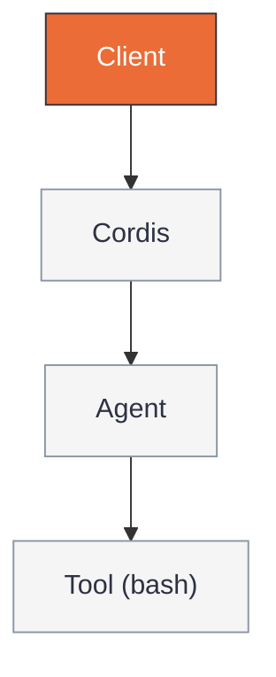
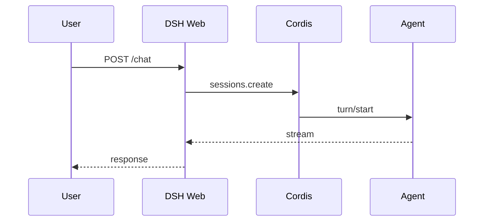
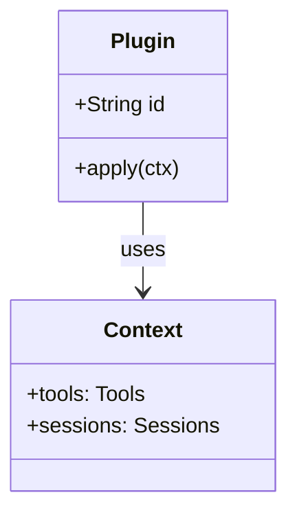
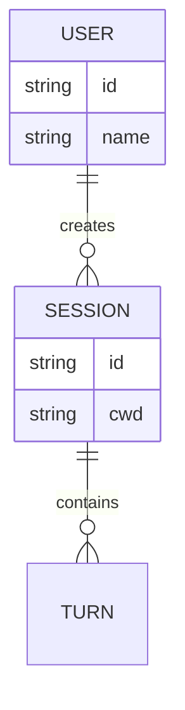
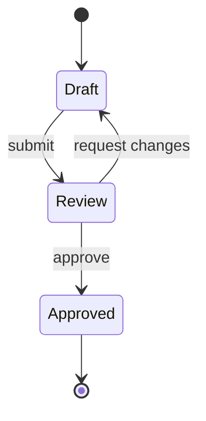

# Diagram Studio Cheatsheet — 5 Mermaid Types

Minimal, GitHub-native examples. Copy verbatim, then replace labels. All use `flowchart TB` / semantic type + `classDef` tokens from `style-guide.md`.

## flowchart

Components + connections. Use `flowchart TB` or `flowchart LR`, never `graph`.

## sequenceDiagram

Messages over time.

## classDiagram

Classes + operations. Use for domain models, service graphs.

## erDiagram

Entities + fields. Use for data models.

## stateDiagram

States + guards. Use for lifecycles, state machines.

> Style: see `style-guide.md` for tokens `paper/ink/accent/muted/link` and `classDef` definitions. Density 4/10, >9 nodes → split.

