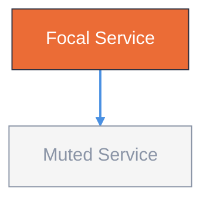

# Diagram Studio Style Guide

Single source of tokens for both Mermaid `classDef` and editorial HTML export. Fork-trimmed from `cathrynlavery/diagram-design`.

## Tokens

| Role | Hex | Usage | Mermaid classDef |
|------|-----|-------|------------------|
| paper | `#f5f5f5` | background, card fill | `fill:#f5f5f5` |
| ink | `#2d3142` | primary text, strokes | `stroke:#2d3142,color:#2d3142` |
| accent | `#eb6c36` | focal path, 1-2 nodes max | `fill:#eb6c36,stroke:#2d3142,color:#fff` |
| muted | `#8a94a6` | secondary, borders, muted nodes | `stroke:#8a94a6,color:#8a94a6` |
| link | `#4a90e2` | edges, interactive | `stroke:#4a90e2` |

## Mermaid classDef Preset

Define once at the end of each diagram block:



Rules:
- **One focal class only** — `focal`/`accent` for the hot path (1-2 nodes). Everything else `muted` or default.
- **No shadows** — never `shadow:true` or `drop-shadow`.
- **Rounded max `rx:6`** — keep corners subtle.
- **Mono only for ports/URLs** — e.g. `` ` :3080` `` or `https://…`.
- **Density 4/10** — generous whitespace; if >9 nodes, split into overview + detail.

## Editorial HTML Mapping

When exporting to `docs/diagrams/*.html`, map tokens to CSS variables:

```css
:root {
  --paper: #f5f5f5;
  --ink: #2d3142;
  --accent: #eb6c36;
  --muted: #8a94a6;
  --link: #4a90e2;
}
```

Keep HTML self-contained (inline CSS, no external JS) for client deck portability.

## Deck HTML Layout Tokens

When exporting to `docs/diagrams/maestro-harness-deck.html` (3-page A4 deck), use these spacing tokens to avoid cramped headers (density 4/10 for text too):

```css
/* Header — generous whitespace, not wall of text */
.page header { margin-bottom: 16px; }
.page header h1 { margin: 0 0 8px; line-height: 1.3; }
.page header p { margin: 4px 0; line-height: 1.6; }
.page header p.meta { margin-top: 8px; }
.meta span { padding: 3px 10px; margin-right: 8px; margin-bottom: 4px; line-height: 1.4; }
```

Rules:
- **Header margin 16px** — generous gap before the diagram image, not 12px cramped.
- **H1 margin 8px + line-height 1.3** — title breathes, not stuck to subtitle.
- **P margin 4px + line-height 1.6** — subtitle and meta have air, not `margin:0`.
- **Meta pills 8px gap + 3×10 padding** — `flowchart TB` and `10 plugins` don't run together (`flowchart TB10` bug).
- **Figure note 12px** — `.figure .note` and `pre.mermaid + .note` must have `margin-top:12px`, not 0 (pre `margin:0` + note stuck bug in `harness-architecture.html`).
- **Cluster header padding via mermaid init, not CSS** — use `%%{init: {'flowchart': {'padding': 10, 'nodeSpacing': 18, 'rankSpacing': 28}}}%%` so Runtime/Microkernel headers don't overlap content below. CSS `.cluster-label span {padding: 4px 0 12px}` looks right but increases label size without moving cluster rect → makes overlap worse ("càng sửa càng dính").
- Verify with `grep -n "header.*margin\|line-height" docs/diagrams/maestro-harness-deck.html` — must show 16px/1.6, not 0. For SVG, `grep "%%{init" docs/architecture.md` must show `padding.*10`.

