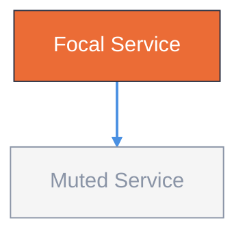

# Diagram Studio Style Guide

Single source of tokens for both Mermaid `classDef` and editorial HTML export. Fork-trimmed from `cathrynlavery/diagram-design`.

## Tokens

| Role | Hex | Usage | Mermaid classDef |
|------|-----|-------|------------------|
| paper | `#f5f5f5` | background, card fill | `fill:#f5f5f5` |
| ink | `#2d3142` | primary text, strokes | `stroke:#2d3142,color:#2d3142` |
| accent | `#eb6c36` | focal path, 1-2 nodes max | `fill:#eb6c36,stroke:#2d3142,color:#fff` |
| muted | `#8a94a6` | secondary, borders, muted nodes | `stroke:#8a94a6,color:#8a94a6` |
| link | `#4a90e2` | edges, interactive | `stroke:#4a90e2` |

## Mermaid classDef Preset

Define once at the end of each diagram block:



Rules:
- **One focal class only** — `focal`/`accent` for the hot path (1-2 nodes). Everything else `muted` or default.
- **No shadows** — never `shadow:true` or `drop-shadow`.
- **Rounded max `rx:6`** — keep corners subtle.
- **Mono only for ports/URLs** — e.g. `` ` :3080` `` or `https://…`.
- **Density 4/10** — generous whitespace; if >9 nodes, split into overview + detail.

## Editorial HTML Mapping

When exporting to `docs/diagrams/*.html`, map tokens to CSS variables:

```css
:root {
  --paper: #f5f5f5;
  --ink: #2d3142;
  --accent: #eb6c36;
  --muted: #8a94a6;
  --link: #4a90e2;
}
```

Keep HTML self-contained (inline CSS, no external JS) for client deck portability.

